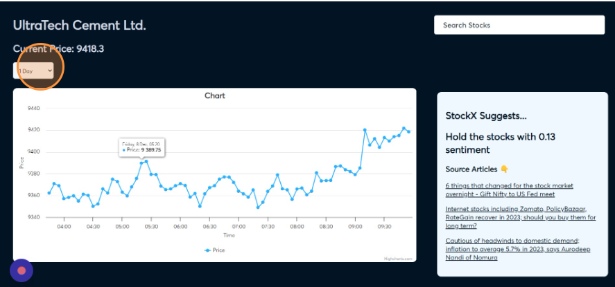
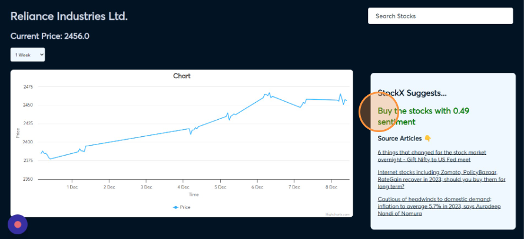

# StockX

## Overview

StockX is a web application that provides real-time stock market data and analytics. It allows users to track stock prices, view historical data, and analyze market trends using news articles. 


## Features

- **Real-Time Data:** Get up-to-the-minute stock prices and market information.
- **News powered Predictions:** Predictions using the current news about market and stocks.
- **Historical Analysis:** Access historical stock data to analyze trends over time.
- **User-friendly Interface:** Intuitive and easy-to-use interface for a seamless user experience.


## Installation

### Clone the repository

```bash
git clone https://github.com/your-username/stockX.git
```

### Change Directory

```bash
cd stockX
```

### Install the dependencies:

_Creating a virtual is Recommended_

```bash
pip install -r requirements.txt
```

### Run the program

```bash
python app.py
```

## Demo

### Home Page


### About Page


### Slider


### 1 Day Graph


### 1 Week Graph


### Max Graph


### Home Page


### Search


### Prediction
